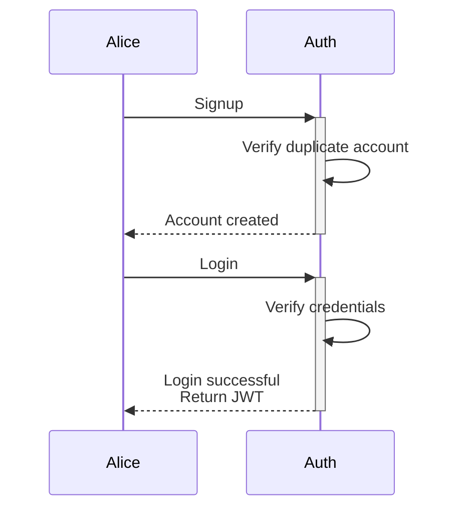
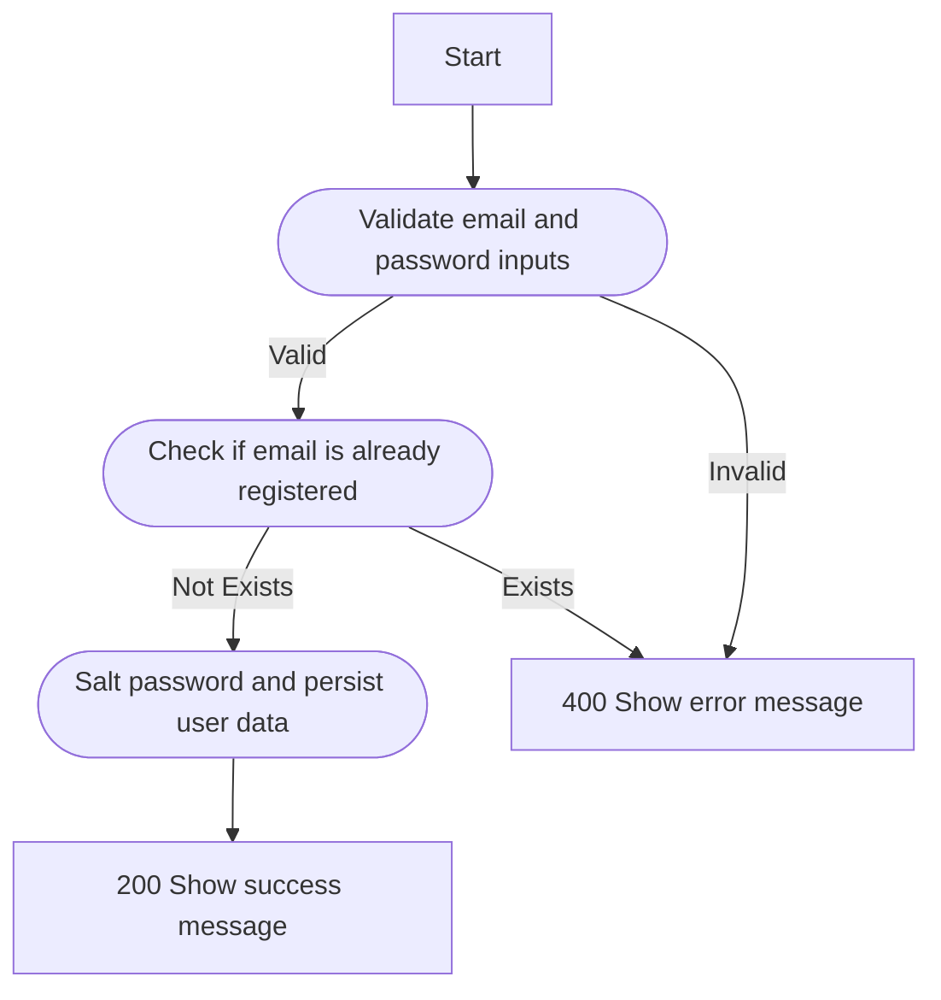
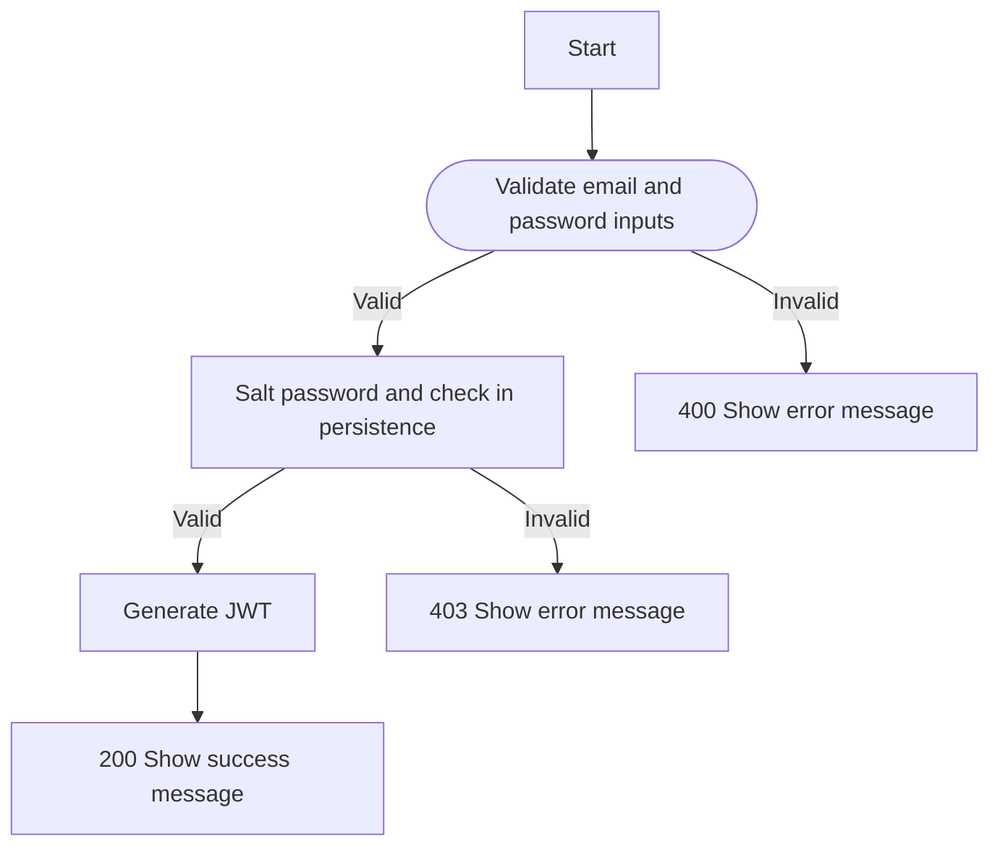
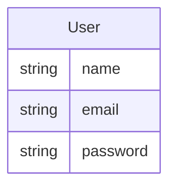

```mermaid
sequenceDiagram
    Alice->>+Auth: Signup
    Auth->>Auth: Verify duplicate account
    Auth-->>-Alice: Account created
    Alice->>+Auth: Login
    Auth->>Auth: Verify credentials
    Auth-->>-Alice: Login successful<br>Return JWT
```

```mermaid
flowchart
    Start --> Validate([Validate email and password inputs])
    Validate --> |Valid| CheckDuplicate([Check if email is already registered])
    CheckDuplicate --> |Not Exists| Persist([Salt password and persist user data])
    CheckDuplicate --> |Exists| EndError[400 Show error message]
    Validate --> |Invalid| EndError[400 Show error message]
    Persist --> EndSuccess[200 Show success message]
```

```mermaid
flowchart
    Start --> Validate([Validate email and password inputs])
    Validate --> |Valid| CheckCredentials[Salt password and check in persistence]
    Validate --> |Invalid| EndError[400 Show error message]
    CheckCredentials --> |Valid| GenerateJWT[Generate JWT]
    CheckCredentials --> |Invalid| EndForbidden[403 Show error message]
    GenerateJWT --> EndSuccess[200 Show success message]
```

```mermaid
erDiagram
    User {
        string name
        string email
        string password
    }
```